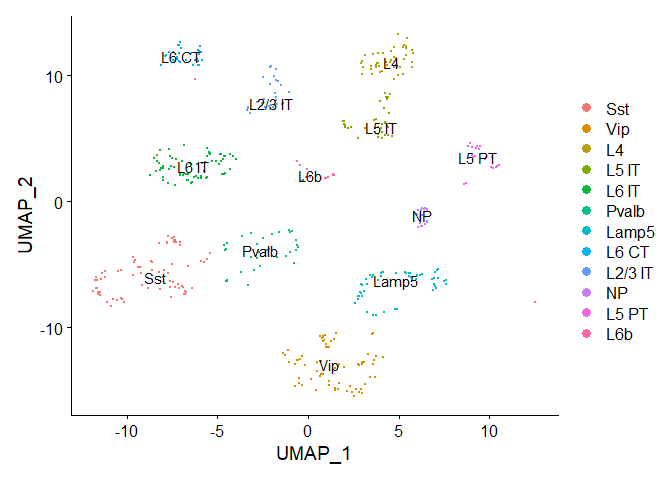
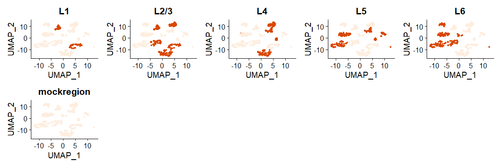
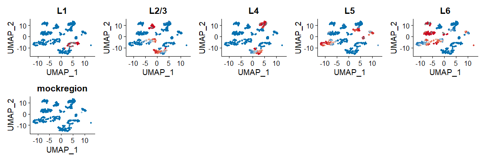
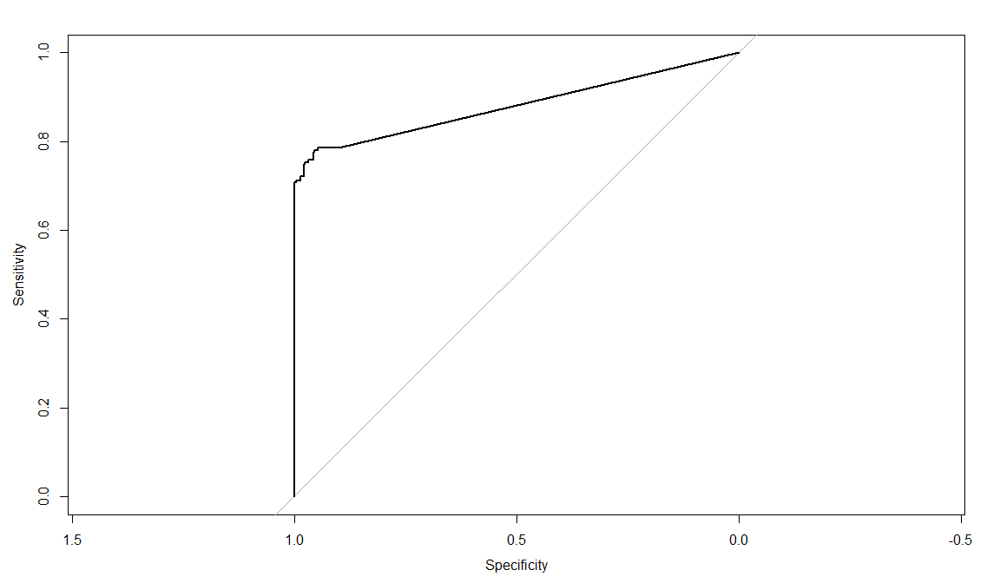

Analyzing synthetic Visium-like spot data for evaluating label transfer
methods
================
Robin Browaeys
2020-10-08

<!-- github markdown built using 
rmarkdown::render("vignettes/analyze_syn_data.Rmd", output_format = "github_document")
-->

In this vignette, you can learn how to use synthvisium to generate
synthetic Visium-like spot data and see a possible workflow to analyze
these data. As a specific case, we will show how you could use these
datasets to evaluate Seurat’s label transfer.

``` r
library(Seurat)
library(synthvisium)
library(tidyverse)
```

# Generating Visium-like spot data from real input scRNAseq data.

The real input scRNAseq (Allen Brain Atlas brain cortex) can be
downloaded from Zenodo and should preferably be download locally and
then loaded here.

For demonstration purposes we will use the internal toy data here

``` r
# seurat_obj_scrnaseq = readRDS(url("https://zenodo.org/record/3260758/files/seurat_obj_scrnaseq_cortex_filtered.rds"))
seurat_obj_scrnaseq = seurat_obj # the internal object 
seurat_obj_scrnaseq@meta.data$celltype = seurat_obj_scrnaseq@meta.data$subclass
seurat_obj_scrnaseq = seurat_obj_scrnaseq %>% SetIdent(value = "celltype")
DimPlot(seurat_obj_scrnaseq, reduction = "umap",pt.size = 0.5, label = T)
```

<!-- -->

Now, we will create a synthetic dataset based on this real dataset and
with a more realistic number of spots. This will take some time to run.
As example dataset type, we pick here `real_top2_overlap`.

Because it could be possible that a cell type will belong to all
regions, we will make the synthetic data in such a way that we have a
‘mock region’ as well - no cell type should be predicted to belong to
this region. Adding a mock region is thus recommended when the synthetic
data will be used to evaluate spatial/region annotation of cells, not
when evaluating deconvolution tools. The mock region is generated
similar as the real regions, but the input cell type frequencies are the
same for each cell type, and after generation of the counts, the gene
names are shuffled such that cellular identities in this mock region are
lost.

``` r
synthetic_visium_data = generate_synthetic_visium(seurat_obj = seurat_obj_scrnaseq, dataset_type = "real_top2_overlap", clust_var = "subclass", region_var = "brain_subregion" , n_regions = NULL,
                                                    n_spots_min = 50, n_spots_max = 200, visium_mean = 20000, visium_sd = 5000, add_mock_region = TRUE)
```

# Processing the synthetic Visium data

### Make a Seurat object from the synthetic counts

``` r
seurat_obj_visium = CreateSeuratObject(counts = synthetic_visium_data$counts, min.cells = 2, min.features = 200, assay = "Spatial")
```

### Preprocessing via SCTransform

``` r
seurat_obj_visium = SCTransform(seurat_obj_visium, assay = "Spatial", verbose = FALSE)
```

### Dimensionality reduction and clustering

``` r
seurat_obj_visium = RunPCA(seurat_obj_visium, assay = "SCT", verbose = FALSE)
seurat_obj_visium = RunTSNE(seurat_obj_visium, reduction = "pca", dims = 1:30)
seurat_obj_visium = RunUMAP(seurat_obj_visium, reduction = "pca", dims = 1:30)
```

### Clustering

This will group the spots in clusters/regions based on gene expression

``` r
seurat_obj_visium = FindNeighbors(seurat_obj_visium, reduction = "pca", dims = 1:30)
seurat_obj_visium = FindClusters(seurat_obj_visium, verbose = FALSE,resolution = 0.1)
```

### Visualization of the synthetic Visium-spot data

Compare the prior regions with the clusters found based on gene
expression

``` r
p_priorregion = DimPlot(seurat_obj_visium, reduction = "umap", label = TRUE, group.by = "orig.ident") # a priori defined regions
p_exprs_clusters = DimPlot(seurat_obj_visium, reduction = "umap", label = TRUE) # a priori defined regions
patchwork::wrap_plots(list(p_priorregion, p_exprs_clusters), nrow = 1)
```

<!-- -->
Here, they map very nicely onto eachother, probably because this dataset
type can be considered as ‘easy’ and different regions have strongly
distinct cell type composition.

# Perform Seurat Label Transfer

Here we will show how to predict for each cell (scRNAseq data - spatial
label unknown) the probabilities to belong to certain regions (spatial
label from ‘synthetic Visium’ data).

### Define which spatial label to use: the prior regions or the gene-expression cluster labels.

Here we go for the prior regions

``` r
seurat_obj_visium@meta.data$region = seurat_obj_visium@meta.data$orig.ident # if you want to transfer the label of priorregion clusters
seurat_obj_visium = seurat_obj_visium %>% SetIdent(value = "region")
```

### Perform the label transfer for spatial annotation of cells and add the region predictions as new Assay to the Seurat Object

``` r
if(DefaultAssay(seurat_obj_visium) != "SCT"){
  DefaultAssay(seurat_obj_visium) = "SCT"
}
if(DefaultAssay(seurat_obj_scrnaseq) != "SCT"){
  DefaultAssay(seurat_obj_scrnaseq) = "SCT"
}

# Define parameters used for the label transfer

parameter_input = list( 
  npcs = 30, 
  k.anchor = 50, 
  k.filter = 200, 
  k.score = 50
)

# Define anchors (step 1 of label transfer)
anchors = FindTransferAnchors(reference = seurat_obj_visium, query = seurat_obj_scrnaseq, normalization.method = "SCT", verbose = FALSE,
                              npcs = parameter_input$npcs, k.anchor = parameter_input$k.anchor, k.filter = parameter_input$k.filter, k.score = parameter_input$k.score) # check other parameters of this function

# Use anchors to transfer the labels (label is here: region metadata column of visium) (step 2 of the label transfer)
# this outcome is an 'seurat assay' that we will call 'regions': each cell has a score for each region in this matrix
predictions.assay = TransferData(anchorset = anchors, refdata = seurat_obj_visium$region, weight.reduction = seurat_obj_scrnaseq[["pca"]], prediction.assay = TRUE, verbose = FALSE) # check parameters of this function

seurat_obj_scrnaseq[["regions"]] = predictions.assay
seurat_obj_scrnaseq[["regions"]]@data = seurat_obj_scrnaseq[["regions"]]@data[seurat_obj_visium$region %>% unique(), ]
```

# Add the gold standard region information from the synthetic data as new Assay to the scRNAseq data

Just as we added the region predictions as new Assay to the scRNAseq
object, we will now also add ground truth / gold standard region

``` r
gold_standard_priorregion = synthetic_visium_data$gold_standard_priorregion

metadata = seurat_obj_scrnaseq@meta.data %>% rownames_to_column("cell_id") %>% as_tibble()
cell_priorregion = metadata %>% inner_join(gold_standard_priorregion) %>% select(cell_id, prior_region, present) %>% distinct()
cell_priorregion_spread =  cell_priorregion %>% spread(cell_id, present) 
cell_priorregion_matrix = cell_priorregion_spread %>% select(-prior_region) %>% as.matrix() %>% magrittr::set_rownames(cell_priorregion_spread$prior_region)
cell_priorregion_matrix[cell_priorregion_matrix == TRUE] = 1
cell_priorregion_matrix[cell_priorregion_matrix == FALSE] = 0

seurat_obj_scrnaseq[["GS"]] = CreateAssayObject(data = cell_priorregion_matrix)
```

# Compare gold standard regions to region predictions: visualization

Visualize the gold standard

``` r
if(DefaultAssay(seurat_obj_scrnaseq) != "GS"){
  DefaultAssay(seurat_obj_scrnaseq) = "GS"
}

# add the names of the regions here (change if necessary)
basic_plot = FeaturePlot(seurat_obj_scrnaseq, features = c("L1","L2/3","L4", "L5" ,"L6","mockregion"), ncol = 3, combine = FALSE)

custom_scale_fill = scale_color_gradientn(colours = RColorBrewer::brewer.pal(n = 4, name = "Oranges"),values = c(0,0.2, 0.4, 0.6,  1),  limits = c(0, 1))
gs_plots = lapply(basic_plot, function (x) x + custom_scale_fill + theme(legend.position = "none")) %>% patchwork::wrap_plots(ncol = 5)
gs_plots
```

<!-- -->

Visualize the predictions

``` r
# Visualize the 'region prediction scores' of each cell - regions assay
if(DefaultAssay(seurat_obj_scrnaseq) != "regions"){
  DefaultAssay(seurat_obj_scrnaseq) = "regions"
}
# add the names of the regions here (change if necessary) (seurat_obj_scrnaseq %>% rownames())
basic_plot = FeaturePlot(seurat_obj_scrnaseq, features = c("L1","L2/3","L4", "L5" ,"L6", "mockregion"), ncol = 3, combine = FALSE)

custom_scale_fill = scale_color_gradientn(colours = RColorBrewer::brewer.pal(n = 4, name = "RdBu") %>% rev(),values = c(0,0.2, 0.4, 0.6,  1),  limits = c(0, 1))
pred_plots = lapply(basic_plot, function (x) x + custom_scale_fill + theme(legend.position = "none")) %>% patchwork::wrap_plots(ncol = 5)
pred_plots
```

<!-- -->

Put the visualizations next to each other

``` r
patchwork::wrap_plots(list(gs_plots, pred_plots), nrow = 2) 
```

<!-- -->
You see that predictions don’t cover all regions they should cover\!

# Compare gold standard regions to region predictions: classification evaluation

A very short intro in how to quantitatively evaluate the predictions:
example for the region L5

``` r
prediction_vector_L5 = seurat_obj_scrnaseq[["regions"]]@data["L5",] 
response_vector_L5 = seurat_obj_scrnaseq[["GS"]]@data["L5",] 

ROC_object = pROC::roc(response_vector_L5, prediction_vector_L5, plot = TRUE)
```

<!-- -->

``` r
ROC_object$auc
## Area under the curve: 0.8798
```

# Notes on generating synthetic Visium data and evaluating it for integration methods

To avoid potential bias, we recommend to split your input scRNAseq in
two equivalent sub-datasets (eg through stratified sampling of half of
the cells for one sub-dataset, and the other half of the cells for the
second sub-dataset). One sub-dataset can then be used to generate the
synthetic visium dataset, the second sub-dataset can be used to
integrate with the synthetic visium dataset for evaluation. This way,
the generation and evaluation will be performed based on different
single cells.

Instead of splitting one dataset into two, it is also possible to use
different datasets (but containing the same cell types and cell type
labels) for generation and integration/evaluation. This way you could
check the potential effect of batch effects or cross-platform
differences (eg use single-nucleus dataset to generate the synthetic
data, and single-cell to integratie/evaluate and compare this to the
situation where both generation and integration/evaluation datasets came
from the same platform).
